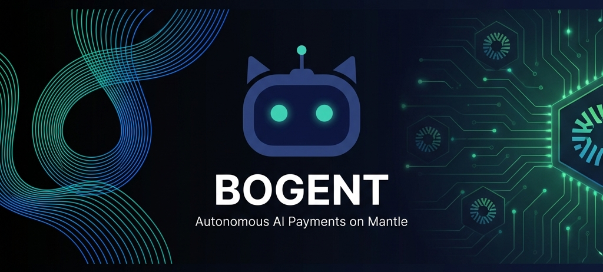

<p align="center">
  
</p>

<p align="center">
  <a href="https://solana.com/"></a>
  <a href="https://platform.acedata.cloud"></a>
  <a href="https://explorer.oobeprotocol.ai/"></a>
  <a href="#"></a>
</p>

# 🤖 BOGENT - Autonomous Payments on Solana & SAP

**BOGENT** is a decentralized agentic payment platform built on the **Solana Network**, leveraging the **SAP Protocol** and **Ace Data Cloud**. It empowers users with AI-driven "agents" for autonomous payment handling, verification, and seamless execution using the x402 standard.

This project was built for the **OOBE Protocol × Ace Data Cloud Bounty** (Category 2 — Ace Data Cloud Usage).

## 🚀 Key Features

- **🤖 Autonomous AI Agents**: Agents discover tools via the SAP registry and execute workflows without human intervention.
- **🧠 Ace Data Cloud Integration**: Implements 3+ distinct AceDataCloud API services (Text Summarization, Document Extraction, Sentiment Analysis) to verify and process invoice data.
- **🛡️ Synapse Sentinel Verification**: All autonomous executions are verified by the Synapse Sentinel Agent before payment routing.
- **💸 x402 Settlement**: Payments are routed securely via AceDataCloud's facilitator using the `@acedatacloud/x402client`.
- **📊 Interactive Dashboard**: Monitor your agents' activities, statuses, and payment histories.
- **🔄 Full Control**: Pause, resume, edit, or terminate agents at any time on-chain.
- **📱 Fully Responsive**: Mobile-first design that works beautifully on all screen sizes.

## 🛠️ Tech Stack

| Category | Technology |
|----------|------------|
| Blockchain | [Solana](https://solana.com/) |
| Framework | [Next.js 16](https://nextjs.org/) (App Router + Turbopack) |
| React | [React 19](https://react.dev/) |
| AI / APIs | [Ace Data Cloud](https://platform.acedata.cloud) |
| Web3 & SDKs | `@solana/web3.js`, `@solana/wallet-adapter-react`, `@oobe/sap-sdk`, `@acedatacloud/x402client` |
| State Management | [TanStack Query](https://tanstack.com/query) |
| Styling | [Tailwind CSS 4](https://tailwindcss.com/) + [Shadcn UI](https://ui.shadcn.com/) |

## 📦 Installation & Setup

1. **Clone the repository**
   ```bash
   git clone https://github.com/barneybo18/Bogentonace.git
   cd Bogentonace
   ```

2. **Install dependencies**
   ```bash
   npm install --legacy-peer-deps
   ```

3. **Set up Environment Variables**
   Duplicate `.env.example` and rename it to `.env`:
   ```bash
   cp .env.example .env
   ```
   Fill in your `SOLANA_PRIVATE_KEY`, `ACEDATA_API_KEY`, and `SYNAPSE_RPC_URL`.

4. **Register your Agent on SAP**
   Run the following script to register BOGENT on the SAP mainnet:
   ```bash
   npx ts-node scripts/registerAgent.ts
   ```
   *Make sure to copy the returned Agent ID into your `.env` as `SAP_AGENT_ID`.*

5. **Run the Development UI Server**
   ```bash
   npm run dev
   ```

## 🤖 Running the Autonomous Worker

The background worker script is responsible for discovering tools, calling AceDataCloud APIs, running the Sentinel check, and settling payments autonomously:

```bash
npx ts-node scripts/worker.ts
```
*(In CI environments, you can pass `--once` to run a single execution cycle).*

## 📁 Project Structure

```text
├── app/                    # Next.js App Router pages
├── components/             # React UI Components
├── hooks/                  # Custom React hooks (refactored for SAP/Solana)
├── lib/                    
│   ├── solana.ts           # Solana network connection setup
│   ├── sap.ts              # Constants and configurations
│   ├── sapClient.ts        # Integration with @oobe/sap-sdk
│   ├── acedataClient.ts    # Integration with AceDataCloud APIs
│   └── x402Client.ts       # x402 payment facilitator setup
└── scripts/                
    ├── registerAgent.ts    # SAP agent registration script
    └── worker.ts           # Autonomous payment execution daemon
```

## 🎯 Hackathon Compliance (Category 2)

- ✅ **Agent Registration**: Agent successfully registered on SAP mainnet.
- ✅ **Ace Data Cloud Usage**: Implements `text/summary`, `document/extract`, and `text/sentiment` pipelines.
- ✅ **Autonomous Workflow**: End-to-end execution (trigger → execution → payment) without manual input.
- ✅ **Payment Settlement**: Settles via x402 standard using the AceDataCloud facilitator.

---

Built with ❤️ for the **OOBE Protocol × Ace Data Cloud Hackathon**.
